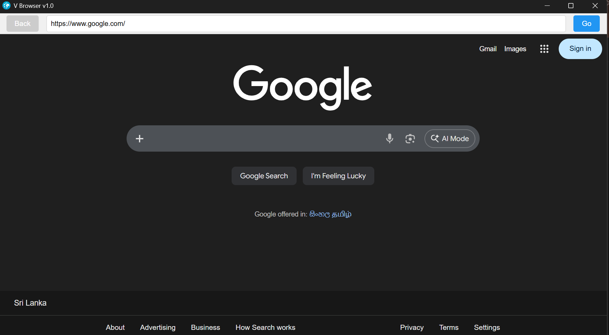

# V-Browser
                               🌐 **V Browser – Fast, Secure &amp; Modern Desktop Browser** 🚀
                                                 💻 ⚡ ($ - $) ⚡ 💻

I’m excited to share a browser software I recently developed for desktop use. This application is designed to provide a fast, simple, and efficient browsing experience with a clean interface.
✨ **Key Features:**
• Lightweight and fast performance
• Always-on-top window option
• Optimized for smooth desktop browsing
This project was built using modern frameworks and packaged as a desktop application. It’s part of my journey in exploring software development and creating practical tools.
More updates and improvements coming soon! 💻

Download : https://www.mediafire.com/file/uegguvhwk45lb0b/v-browser_Setup_1.0.0.exe/file 

## 🎯 Goal

To provide a powerful, reliable, and visually appealing browsing experience for both casual users and developers. Perfect for productivity, research, and daily browsing tasks ✨.

💻 **Built With:Electron Framework 🌐.
📧 **Developer:** Vidura Lakshan Liyanage| Email: viduraliyanage012@gmail.com |+94 766161921

#SoftwareDevelopment #DesktopApp #BrowserApp #Programming #TechProject #electron_software

## 📸 Screenshot 

